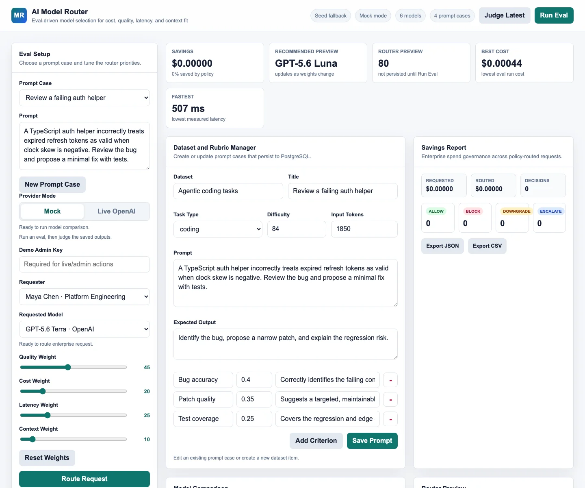

# Rohan Asudani — Software & Applied AI Portfolio

[](https://rohanasudani.github.io/)
[](https://github.com/Rohanasudani/rohanasudani.github.io/actions/workflows/deploy.yml)
[](https://nextjs.org/)
[](https://www.typescriptlang.org/)

Personal portfolio for Rohan Asudani, a University of Arizona Computer Science student and software engineer focused on applied AI, developer tools, backend systems, and production web applications.

**Live site:** [rohanasudani.github.io](https://rohanasudani.github.io/)



## What the site includes

- Professional experience across University of Arizona IT, PawPrint Labs, Arizona Online, and FitArt.
- Engineering case studies for TermAgent, the AI Model Router, PU Realtors, and reinforcement-learning projects.
- A focused technical toolkit covering software engineering, AI/ML, data, infrastructure, and testing.
- Education, academic recognition, résumé access, and direct contact links.
- Responsive layouts, keyboard-friendly navigation, reduced-motion support, and lightweight visual effects.

## Featured engineering work

| Project | Evidence highlighted on the portfolio |
|---|---|
| [TermAgent](https://github.com/Rohanasudani/terminal-coding-agent) | Safety-gated repository tools, reproducible traces, 198 tests, and a documented Harbor evaluation |
| [AI Model Router](https://github.com/Rohanasudani/enterprise-ai-model-router) | Explainable routing, evaluation, policy controls, PostgreSQL persistence, and a deployed demo |
| [PU Realtors](https://purealtors.in/) | A live real-estate lead-generation product with measurable sales impact |
| [Snake & Gridworld RL](https://github.com/Rohanasudani/snake-gridworld-rl) | Reproducible Q-learning, SARSA, and approximate Q-learning comparisons |

## Tech stack

- Next.js App Router and React
- Strict TypeScript
- Component-scoped portfolio sections backed by structured data
- Responsive CSS with animation and reduced-motion handling
- Static export deployed to GitHub Pages through GitHub Actions

## Run locally

```bash
npm install
npm run dev
```

Open `http://localhost:3000`.

Before publishing changes:

```bash
npm run lint
npm run build
```

## Project structure

```text
src/
├── app/                  # Page shell, metadata, and global styling
├── components/           # Portfolio sections and interaction components
├── data/portfolio.ts     # Experience, projects, skills, and contact content
└── hooks/                # Navigation, reveal, and typewriter behavior

public/
├── projects/             # Optimized project imagery
└── resume-rohan-asudani.pdf
```

## Deployment

Pushes to `main` run the GitHub Actions deployment workflow. The Next.js project is statically exported and published through GitHub Pages.

## Contact

- [LinkedIn](https://www.linkedin.com/in/rohan-asudani/)
- [GitHub](https://github.com/Rohanasudani)
- [rohanasudani@arizona.edu](mailto:rohanasudani@arizona.edu)
